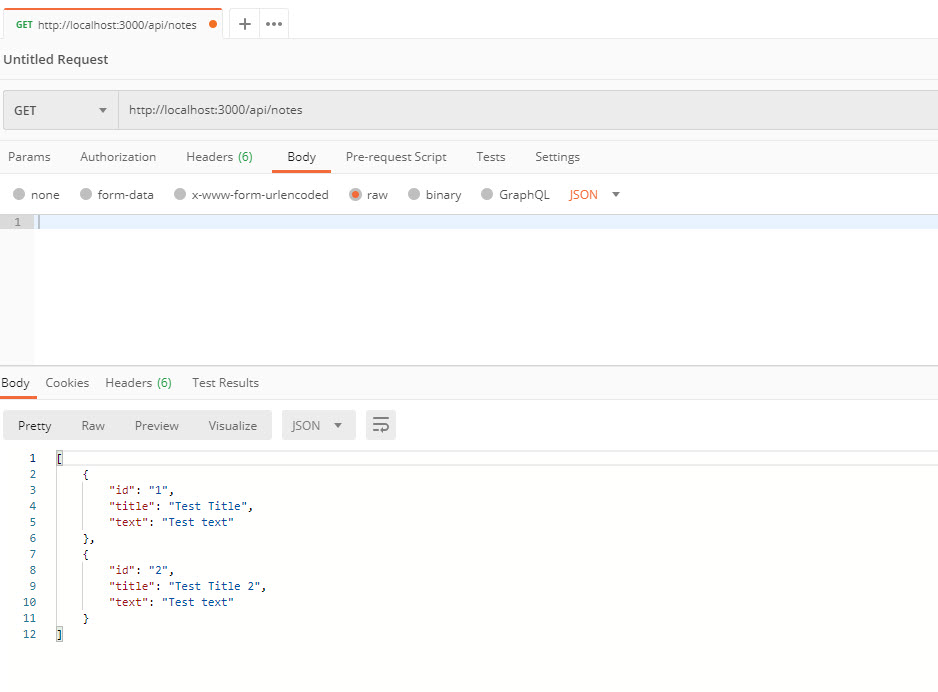

# Note Taker

,,,,

## DESCRIPTION
 
As a user, I want to be able to write, save and delete notes, so that I can organize my thoughts and keep track of tasks I need to complete. 
To keep track of my notes. 
I do not have to rely on cloud based note takers, I can use my local machine if I want. 
I learned how to set up a server in Heroku and how to connect routes to server.js. 
This project stands out because it can be used as a starting tool to make and design your own note taker.    

## Table of Contents

* [Installation](#installation)

* [Usage](#usage)

* [Credits](#credits)

* [License](#License)

* [Contributing](#contributing)

* [Tests](#tests)

* [Questions](#questions)
      
## INSTALLATION

npm install

## USAGE

POSTMAN GET

db.json GET result

POSTMAN POST

db.json POST result

POSTMAN DELETE

db.json DELETE result

  
## CREDITS

No collaborators in this version. Postman for API Development.

  
## LICENSE

MIT License Copyright (c) 2020. Permission is hereby granted, free of charge, to any person obtaining a copy of this software and associated documentation files (the 'Software'), to deal in the Software without restriction, including without limitation the rights to use, copy, modify, merge, publish, distribute, sublicense, and/or sell copies of the Software, and to permit persons to whom the Software is furnished to do so, subject to the following conditions: The above copyright notice and this permission notice shall be included in all copies or substantial portions of the Software. THE SOFTWARE IS PROVIDED 'AS IS', WITHOUT WARRANTY OF ANY KIND, EXPRESS OR IMPLIED, INCLUDING BUT NOT LIMITED TO THE WARRANTIES OF MERCHANTABILITY, FITNESS FOR A PARTICULAR PURPOSE AND NONINFRINGEMENT. IN NO EVENT SHALL THE AUTHORS OR COPYRIGHT HOLDERS BE LIABLE FOR ANY CLAIM, DAMAGES OR OTHER LIABILITY, WHETHER IN AN ACTION OF CONTRACT, TORT OR OTHERWISE, ARISING FROM, OUT OF OR IN CONNECTION WITH THE SOFTWARE OR THE USE OR OTHER DEALINGS IN THE SOFTWARE.
  
## CONTRIBUTING

Please note that this project is released with a Contributor Code of Conduct. By participating in this project you agree to abide by its terms.
  
## TESTS

npm test

## QUESTIONS

Username: noobatl

Email: info@noobusa.com

If you have any questions about this repo, open an issue or contact [JJ Villacres](https://github.com/noobatl) directly at the email above.
